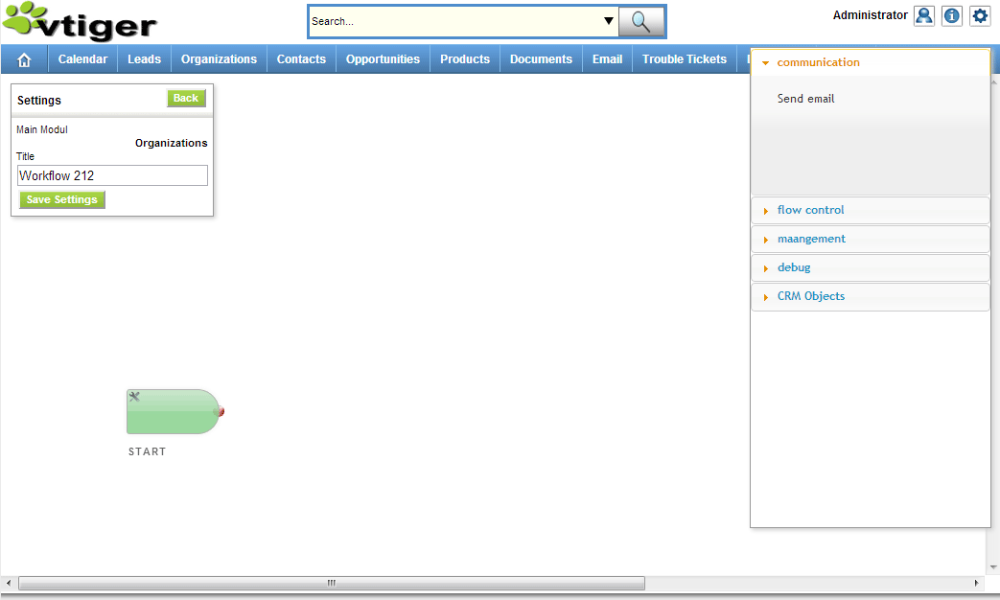
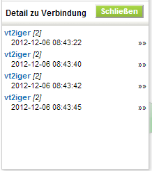

General Documentation
===============================

#### General

This Module gives you the opportunity to implement more complex workflows in your vtigerCRM system without loosing clarity
There are **Task Blocks and individual Paths**, which control the execution flow of the workflow.
Every Workflow has a starting condition, like you create/save or send an email to a record. If you connect the last with the first task, you could create a workflow, which never ends, if you don’t delete the record, which execute the worklfow.
This is the only existing limitation, which is identical to the internal workflow engine. Every Workflow needs a “Host record”, which start the execution.

#### Main panel

This is the main panel with all workflows. If you are an administratior, you arrive this page from the CRM Settings.

From this page, you can do all management of workflows. You can import, export, activate, edit workflows and start statistics.

Also you see, which Workflow is active or inactive.

*Only active workflows will be run within the CRM and are shown in the sidebar widget.*

#### Workflow editing

If you click on `[edit]` you open the editing page, which allows to build your workflows in a modern management frontend.

On this page you can create tasks and connect these task in the way, your company could work with.

You could move all boxes with your mouse. Only click and hold your mouse button and move the box to a better position.
More information about this process, you will get in chapter 2.

#### Statistics

If you click `[statistics]` on the main panel, you get the analysis of your workflow.

Here you can set a time frame, which is used for statistics.

With a quick view you can see the “flow of your entities”, through the workflow.

Stronger lines, show more entities on this path. For detailed statistics, there are percentages and an absolute number.

If you double click on a task block, you can see the time these task used in the last executions. Here you can search for time intensive tasks, if your workflow needs to much time. Also there are some special data, for example the entities wait in delay task.

If you click on an percentages two new boxes opens, which display the entities,

which used these path. Also you can see a graph, which shows the usage of the last days.

If you click on the small arrow on the right, you can see the complete way of this record, through the process.

If you select a record and double click now at one task, you can see the log of this execution. Some tasks (e.g. send mail) shows there problems or the result of mail sending.
Your custom tasks could display data in this place, too.