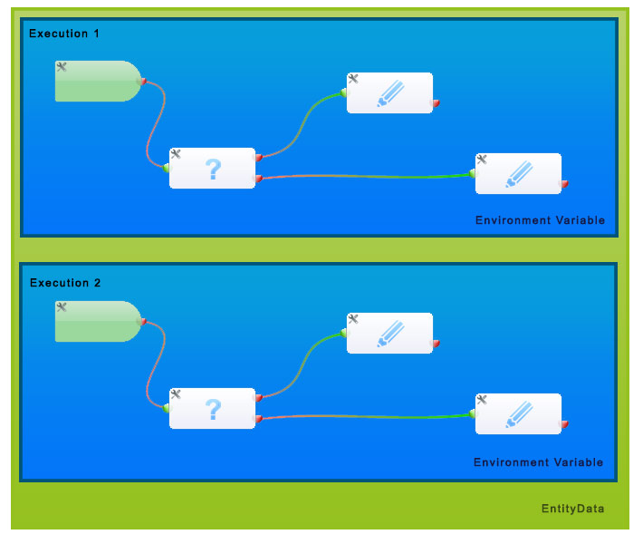

EntityData
==========================

The EntityData system was introduced in version 1.88.

It is similar to the Environment variables, because it is a persistent "key->value" storage for crm records.
Instead of store variables over different blocks in one execution of a Workflow it stores values persistent in a hidden background storage and keep the values also after the single execution was finished. So you could save values over different workflows. I have visualize the scope of these the two different persistent storages in the image next to this text.

To handle this, I have create two new Tasks: **write EntityData** and **read EntityData**, because I don�t want to save all environmental variables from any execution.
These blocks works with a simple system. In the set-Task you set the EntityData Key and could enter the content with the default template textfield.
The reader only accept two simple values, without template feature. The EntityData Key and the environment variable, the EntityData Value should written in.

**Application examples are:**

 - You create an event in an external Calendar system (maybe Google Calendar) and you wants to save the ID of this event for later modifications (date shifting, �)
 - You want to count, how often a workflow was executed, without creating a new field
- You wants to save any data for a record, without creating a new field

#### Possible example:  
**movable Event**  

This Workflow creates an event from 10 � 11 o'Clock and a given date from an Organization field. If you change this date in a record, which already had create this event, the date will be moved to the new value.
**You must modify this workflow to fit your field names.**  

Download: [Workflow to create a movable event](../examples/movable_event_workflow.bin?raw=true)

