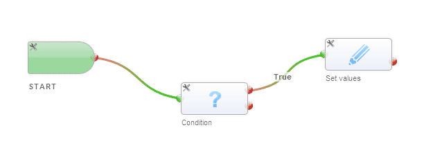
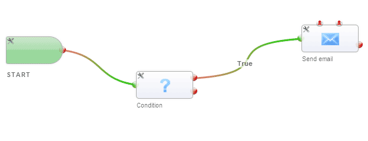
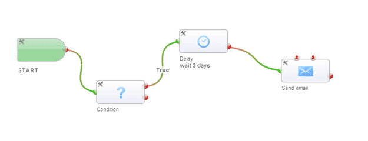
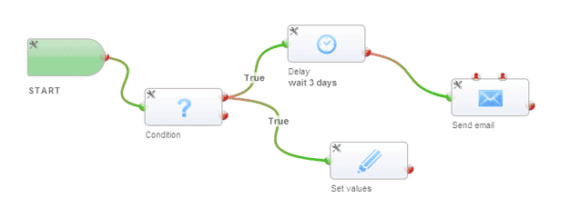

Quick Start
=============================

This page will assist you on your first steps with the Workflow Designer, after you setup the module and configure the license.
At first I will describe the differences to the integrated module and after this, I will write what you could do.

#### Main differences to internal Module
My Workflow Designer is build on single tasks, which could be combined in a individual way.
For example you had the condition in the internal module, which would filter the execution of a workflow. In my module, every record execute every workflow.
It is you task to filter these records, you want to interact with, with a Condition block.  But here you could interact with the false path, too.

Every task has one input and one or multiple outputs. The executer follows the path from one task to another and execute all tasks until the path end. You could connect two tasks in one output and split the execution into two paths. This is no problem.

If you would migrate your old Workflows, the result could look like this examples:

*(Image 4 represent the feature to split the path.)*

Every Workflow run a defined time and quit after the execution. Repeating workflows, like a birthday mail every year don’t works without hacks.

The new Workflow module allows to connect the last output to one of the first inputs. With this you have create a Workflow, which never ends!

#### First Steps
Every Workflow start with the [Start] Block. This block store the configuration like the execution trigger. (Please set “start trigger” to “on first save”)
To configure a block simple double click on the task or use the small utility icon top left of each block.

For this example please add a condition block, from the left menu and setup a condition you like. (For example “lastname” contain “test” in contacts)

Now create a path by drag & drop from the output of the “start” block to the condition input point. To delete a path simple click on the wrong one.

At next use a “set values” block and connect the upper (true) output of condition with the “set values” input and setup a value change setting, you could see.

The result should look like the first image of the upper slideshow.

After you activate the workflow in the overview, you could create a record with the values, which match with the condition you use in condition task.
After the save process you should see the changed value.