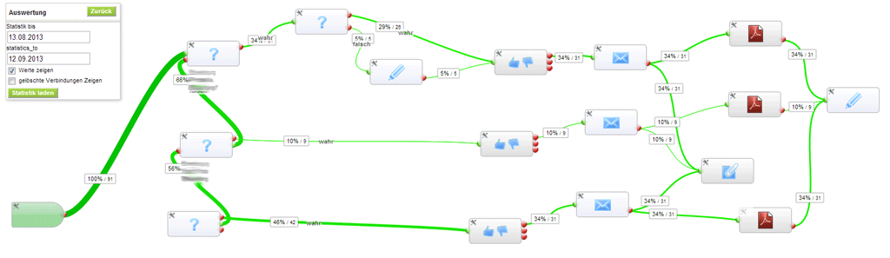
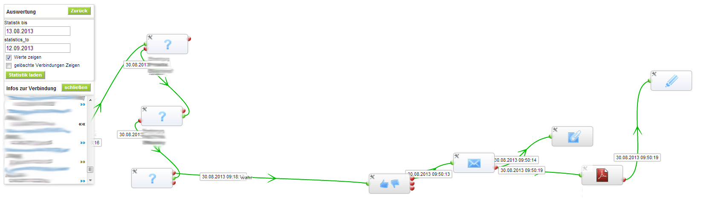

Statistics
================================
There are advanced analyze feature inside the Workflow Designer. You could follow every single execution and search for optimizations.

The Statistics page could look like in this way:

Or if you want to found the execution path of a single record, together with exact date & time it could look like:

If you click on on task in this moment you get a detailed statistics, how long the last 50 executions runs and detailed information about the single execution of these record.
Every task could add additional information, like the “set values” task will "save field" and values it changed or the send mail task saves the smtp result.

Because of the complex statistic there could be lots of log data in the database, which probably is not necessary for older records.
In the "Log management" in the "Workflow Designer Module Configuration" there are two time-span options.
The first one "**minimize logs after**" will remove all data the tasks had save, which are older than the give days. This will heavily decrease the storage used by this logs.
But you keep execution details to review the path usage in future. The default value is 30 days.

The second time span "**remove logs after**" will completely remove log entries after a given amount of days. This makes it impossible to review this executions.
The default value for this second option is 180 days.