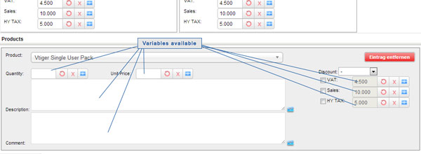

Task: Create Invoice/Quote/SalesOrder
===============================================

This task could be create Invoices, Quotes, ... with selected Products.
You could specify all values of these modules, like item/group tax or discount.

All other settings are equal to the default record creator.

You could select all products you have created in your vtigerCRM system. Also you could generate the product_id with a custom function. (Services are not supported at the moment)

#### Special Environment variables

The fields inside every product have special environment variables to get the default values from the products.
Fields with this feature are marked in the image below this text.

following array to get values from ALL fields inside the product module of the selected module.

`$env["product"]["..."]`

For example you could use

`$env["product"]["unit_price"]`

to calculate with the default Unitprice of the product.