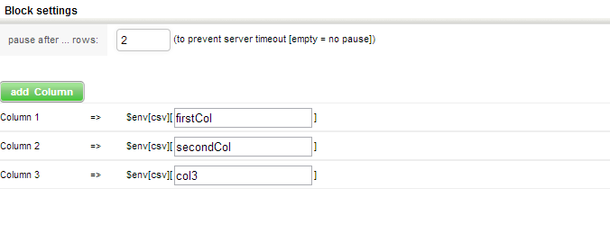

Task: CSV Import
===============================================

This task will be only usable and visible if you set the "Import Process" trigger in the start block and basically build the main feature of the import process.

This example will assign the first column to `$env["csv"]["firstCol"]`, the second to `$env["csv"]["secondCol"]` and the last one to `$env["csv"]["col3"]`. All columns after the third will be ignored.

Also it is important to break the import process if you expect lots of rows and must pay attention to a possible server timeout. (If you use FastCGI for example)
If you set the “pause after” field to 50, every 50 rows will be stopped the current Request and started a new one to the Webserver, which will reset the “pause counter”.
The number don’t reflect only these lines read by this task, but the global line number from the current file. If you execute this task every 5 rows, the break will be insert into the first execution after this limit.

**Please note $env is the environmental variable and only available in custom expressions.**