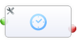

Task: Delay 
=========================================

This task allows you to insert one or more delays into your workflows, which pause the execution until a given date/time will be reach.

#### Options

You could combine multiple of this options, to use this universally
- Base Date
	- Use the date from this field as base date and apply all options to them
	- **Since version 1.88 there is a new checkbox** next to this dropdown. This will enable the dynamic delay feature, which will update the delay date/time if you update the value of the base date field. So you could wait a period of time, which could be defined by users and could be modified after the delay was initiated
- minimum delay
	- This Option guarantee a minimum wait time if you never want to act immediately
	- Also this is the default delay, if you simple want to wait 1 hour/day
	- you could set minutes/hours/days/weeks
- wait until next …
	- this option wait until one selected day of week is reached
- wait until time is
	- if you don’t want to continue this workflow before 8 o’clock, you can do this with this option
- wait until custom time
	- Here you could integrate your own custom function
	- You have to return an Unix Timestamp, which replace the base date (All other options will be applied to this date!)
	
If you want to **wait until a field has a configured value**, please combine the features of delay and conditions. (For example if you want to wait until a checkbox was set)